#  学前先看

##  1  认识TurboPi视觉小车

### 1.1 产品介绍

TurboPi是一款基于树莓派开发的智能视觉机器人，它采用麦克纳姆轮底盘，并搭载高清摄像头，配合OpenCV能实现颜色识别、目标追踪、智能巡线、二维码识别等功能。

TurboPi搭载RGB发光超声波传感器，可以控制灯光变化，并能实现智能避障。此外，它还支持拓展多种传感器，实现更多感知的融合。

### 1.2 硬件介绍

#### 1.2.1  硬件连接系统框图

#### 1.2.2  摄像头

摄像头作为机器人结构中最重要的组件之一，类似于人类眼睛。本款产品用的是130度广角单目相机。

本款相机分辨率为30W（640*480），关于相机更多参数可前往“**4 硬件资料**”进行查看。

#### 1.2.3  树莓派主控

本款产品采用的是**树莓派4B+扩展板**。树莓派4B主板是一种小型的单板计算机，具有基本的计算能力，通过各种接口（如HDMI、USB、GPIO）支持多种外围设备的连接，使其成为学习编程、玩转各种创意项目的理想选择。

树莓派扩展板提供4路直流电机接口，同时板载按键、有源蜂鸣器、RGB灯、PWM/总线舵机接口等，搭配树莓派主控下能更好的进行二次开发与拓展。

主板上安装的是 Debian 11的系统，关于树莓派的课程可前往 **“4 硬件资料”** 查看。

#### 1.2.4  发光超声波

芯片内部集成超声波发射电路、超声波接收电路、数字处理电路等。模块采用 IIC 通信接口，能通过IIC通信进行读取超声波传感器测量的距离。

- **引脚说明**

| 引脚 | 引脚说明   |
| ---- | ---------- |
| 5V   | 电源输入   |
| GND  | 电源地     |
| SDA  | SDA 数据线 |
| SCL  | SCL时钟线  |

关于更多参数可前往“**4 硬件资料**”进行查看。

#### 1.2.5  4路巡线传感器

四路巡线传感器是智能小车或者机器人提供一种多用途的红外线探测系统解决方案。它有四个探头，每个探头都有一个红外发射器和一个红外接收器，由于白色对红外反射强，黑色对红外反射弱，故此模块可用于检测黑、白，具有检测速度快、适应性良好等优点，可应用于智能小车或者机器人的巡线运动，可以巡较为复杂的线路。

- **引脚说明**

| **引脚** | **引脚说明** |
| -------- | ------------ |
| 5V       | 电源输入     |
| GND      | 电源地       |
| SDA      | SDA 数据线   |
| SCL      | SCL时钟线    |

关于更多参数可前往“**4 硬件资料**”进行查看。

#### 1.2.6 云台舵机

云台部分采用的是LFD-01舵机，这款舵机具有控制精度高、线性度好、响应速度快和扭力大等特点，常用于各种仿生机器人的角度关节设计。

- **引脚说明**

| **引脚** | **引脚说明** |
| -------- | ------------ |
| 黄色接线 | 信号线       |
| 红色接线 | 电源正极     |
| 棕色接线 | 地线         |

关于更多参数可前往“**4 硬件资料**”进行查看。

#### 1.2.7 直流电机

电机为机器人的动力模块，本款产品使用的是减速比1:120的直流减速电机，其电压范围为DC3V-6V，空载电流为0.14A-0.17A（DC3V-6V)，输出功率0.6W，关于更多参数可前往“**第7章 拓展课程**”进行查看。

#### 1.2.8 锂电池

本款产品采用的是两节3.7V的18650锂电池，电池容量为1800mAh，关于其充电方法可前往“第3章 动手组装及调试/第2课 设备充电、开机及自检”查看。

###  1.3.产品清单

## 2 组装教程

**(1)**
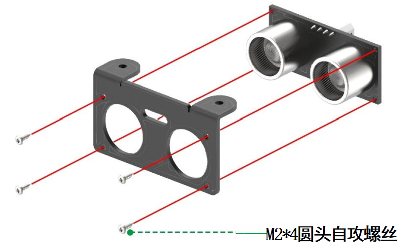

**(2)**
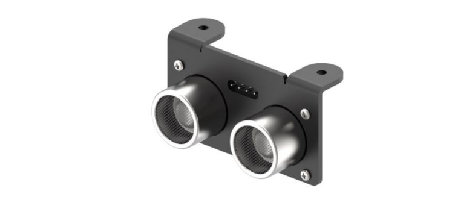

**(3)**
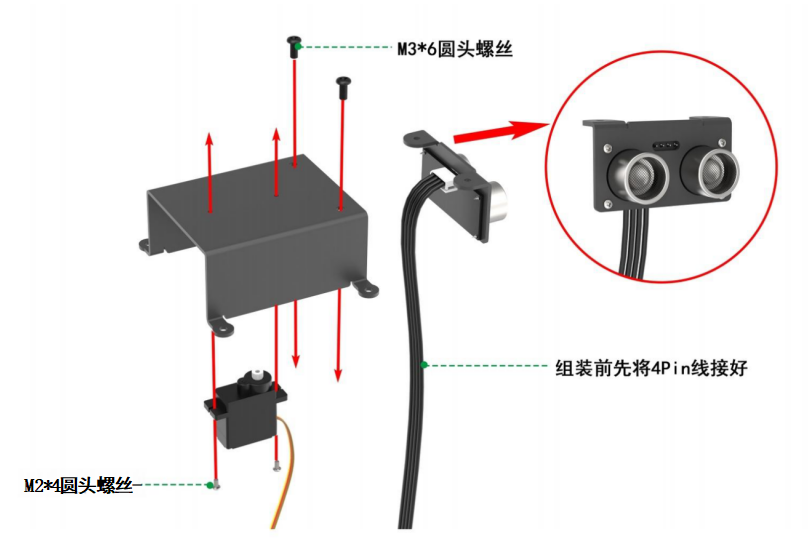

**(4)**
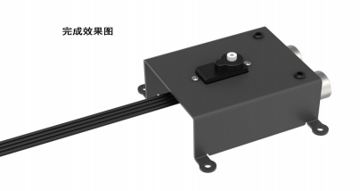

**(5)**
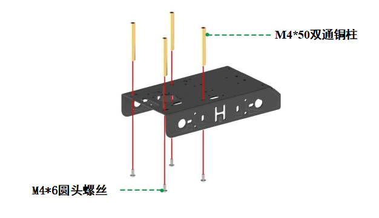

**(6)**

**(7)**
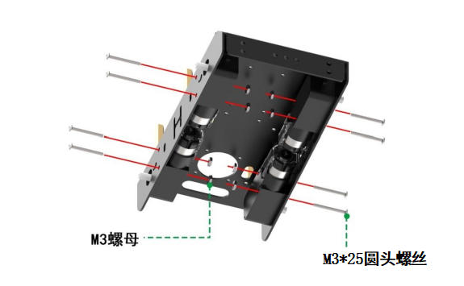

**(8)**
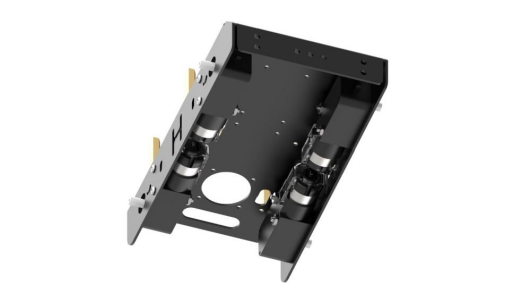

**(9)**
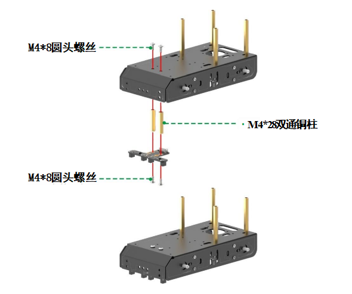

**(10)**
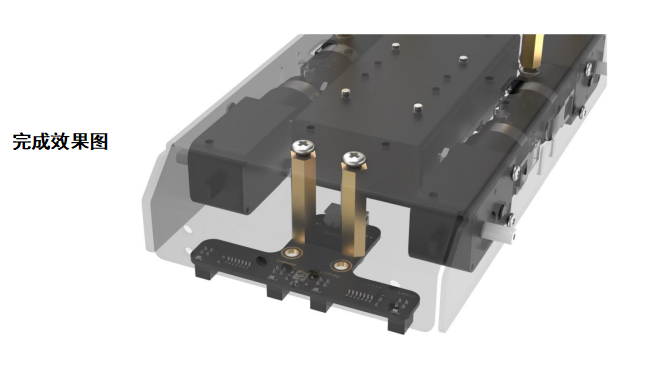

**(11)**
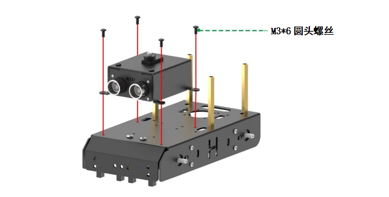

**(12)**
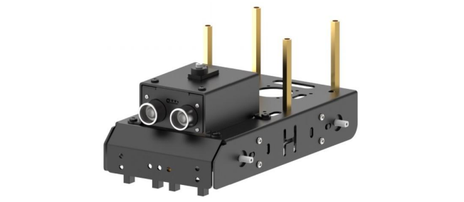

**(13)**
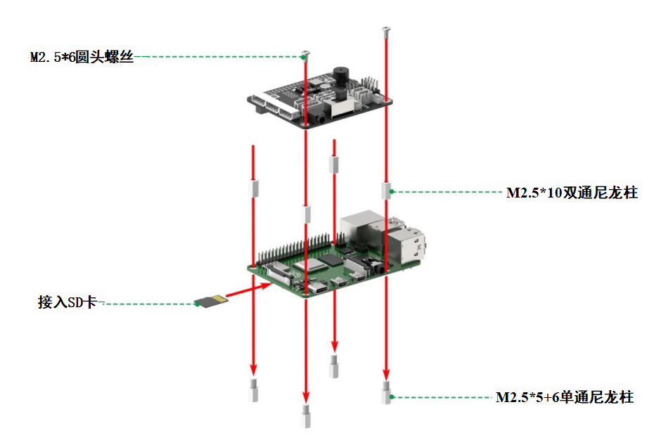

**(14)**
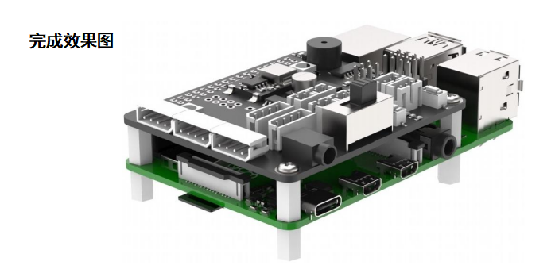

**(15)**
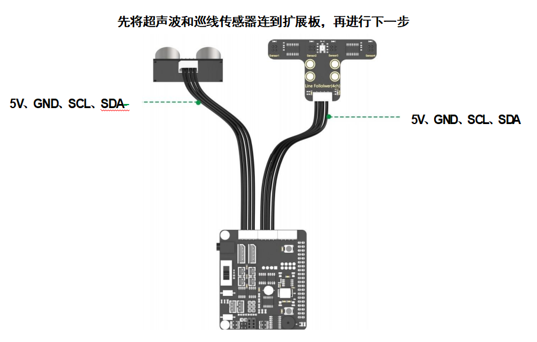

**(16)**
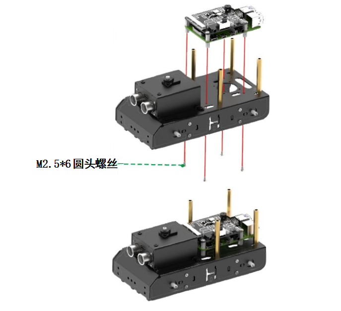

**(17)**
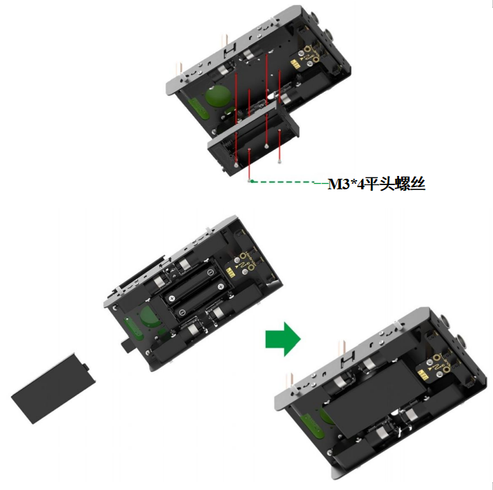

**(18)**
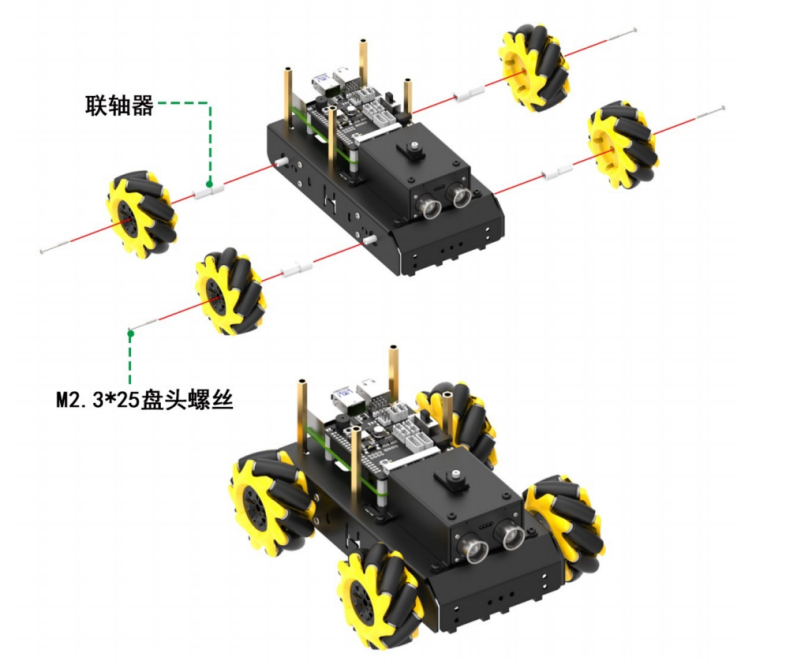

**(19)**
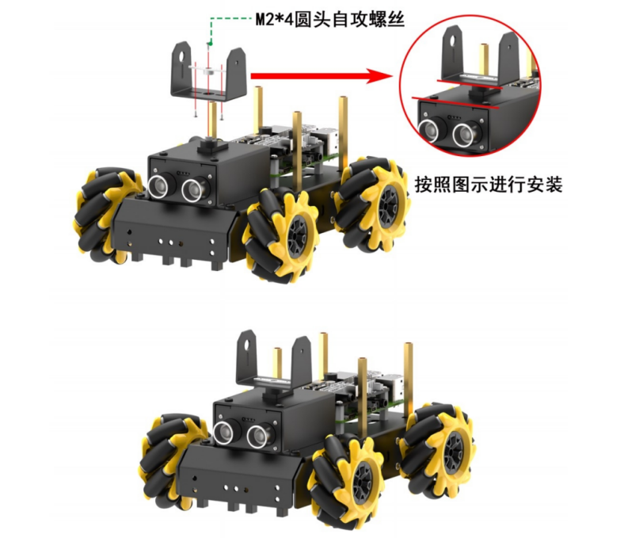

**(20)**
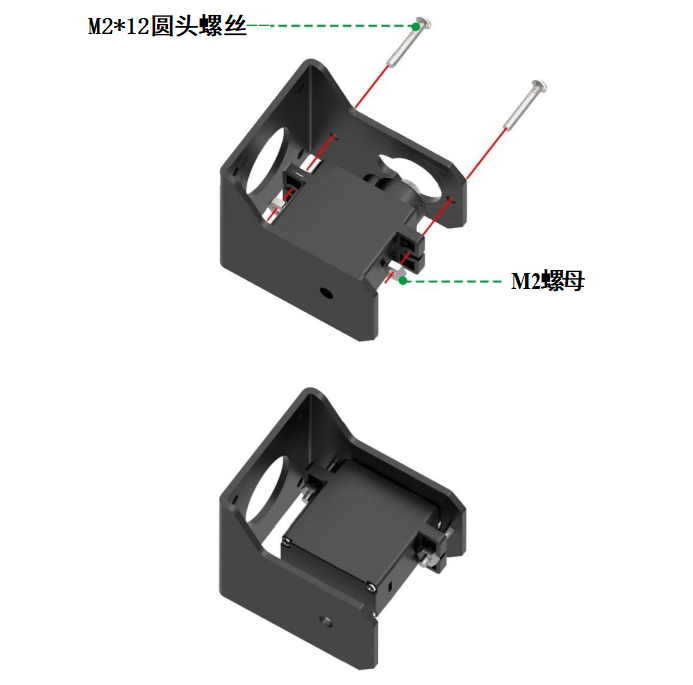

**(21)**
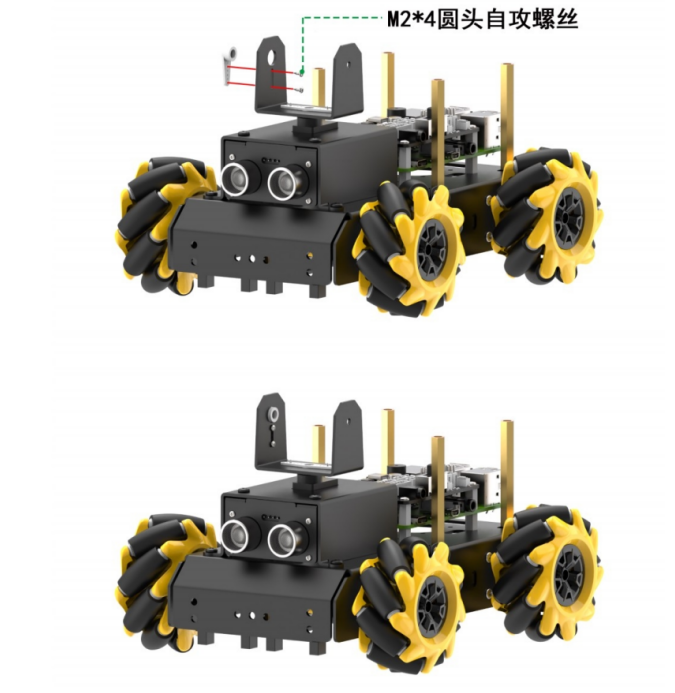

**(22)**
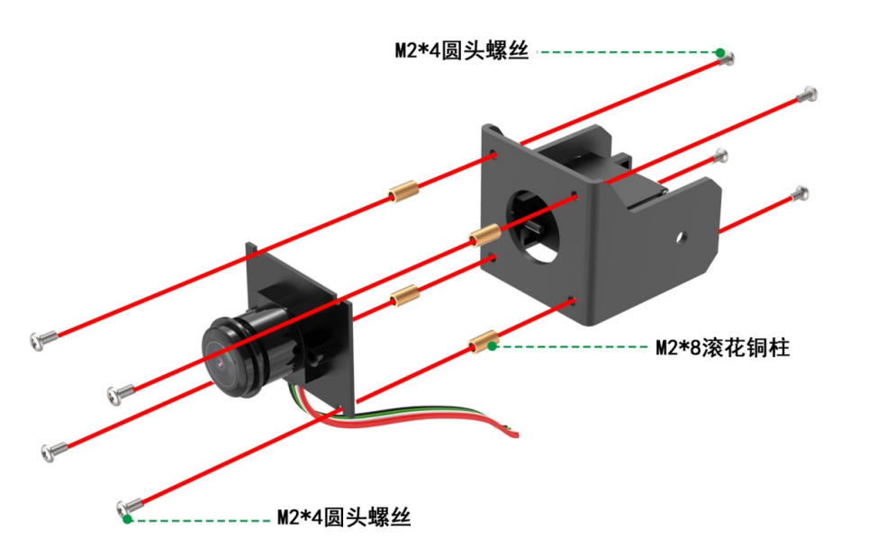

**(23)**
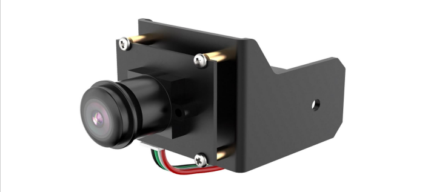

**(24)**
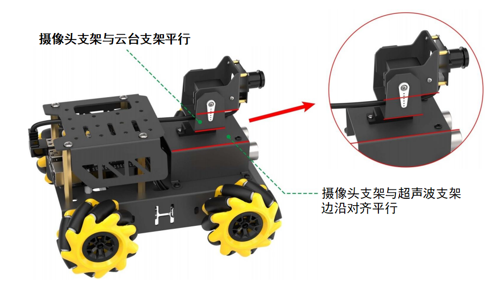

**(25)**
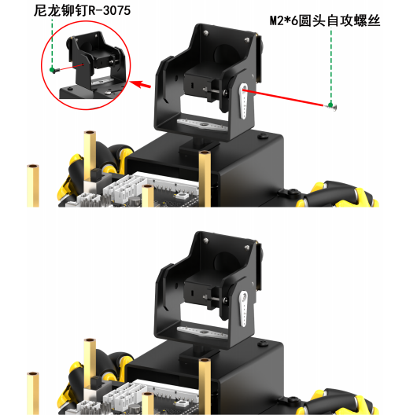

**(26)**
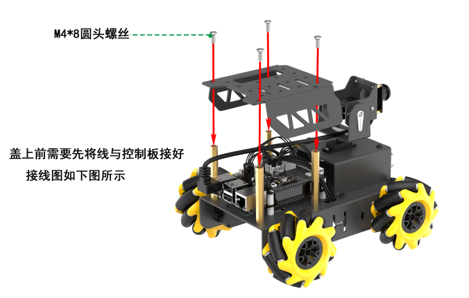

**(27)**
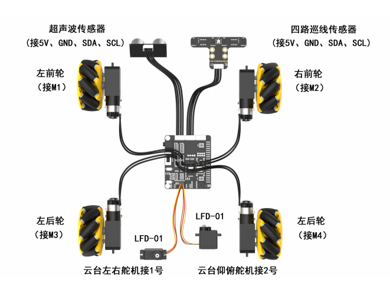

**(28)**
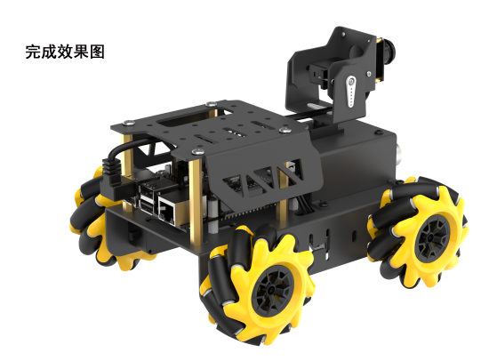

**(29)**
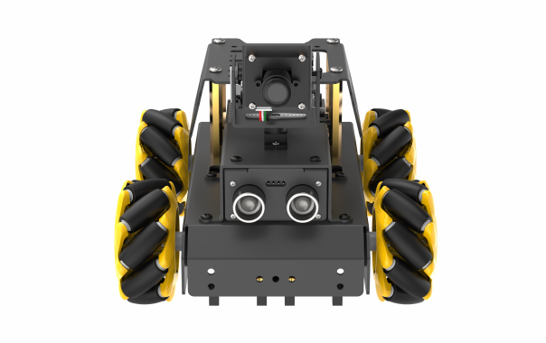

## 3 设备充电、开机及自检

**开机之前请先按照“2 组装教程”内容组装好机器人。**

### 3.1 电池充电及安装

由于运输途中电池不能充满，所以在初次开机前，建议先给电池充满电，以下是具体充 电方法：

1) 拿出电池充电器，将两节 18650 的电池（选配）按照正负极对应（正对正，负对 负）装到电池充电器中，注意！电池正负极切勿装反！再通过数据线将电池充电器连接或用 充电头（5V 1-2A，需自备）。

2) 等待充电完成（适配器指示灯在未通电的状态下为绿色，通电后为红色代表充电中 （充电时长约为 5 个小时左右）、指示灯由红色变为绿色代表充电完成），充电完成后，请 尽快拔掉充电器，切勿一直充电。

### 3.2 安装电池

1) 安装电池前请确保电池盒的开关拨到“**OFF**”档。

2) 将充满电的电池安装到电池盒中，并盖上电池盖。注意！电池正负极切勿装反！

### 3.3 确认摄像头连接

在开机之前请先确认摄像头连接线是否已连接牢固（摄像头连接线可接入树莓派主板上 4 个 USB 接口的任意一个）。

### 3.4 开机状态说明

1) 将电池盒的开关拨到“**ON**”档，再将树莓派扩展板的开关由“**OFF**”推动到“**ON**”， 此时树莓派的 LED1、LED2 常亮，稍等片刻后 LED2 由常亮变为每隔 1 秒闪亮一次、云台回到初始姿态、蜂鸣器发出“嘀”的一声，即设备成功开机。

**注意：**

- 树莓派本身也是电脑，开机启动需要一小段时间，开机时间约 30 秒左右，请耐心 等待。

- LED1 为电源指示灯，通电时点亮，设备运行过程中是常亮的状态，若灯光变暗则 表示电源没电了，需要充电；

- LED2 为通信指示灯，设备出厂默认的网络连接模式为直连模式，设备开机成功后 LED2 每隔 1S 闪烁一次；若将其设置为局域网模式，LED2 则会常亮（关于网络连接模式的设置与介绍，可参照“第 4 章 手机 APP 试玩\\第 2 课 手机 APP 连接”课程进行了解）；

- 设备运行过程中，若 LED1 与 LED2 灯光变暗，并保持常亮的状态，则表示电源没 电了，需要充电。

2) 设备开机成功后，出厂默认为 AP 直连模式，并将产生一个以 HW 开头的热点。

### 3.5 启动自检程序

机器人在开机成功后，可通过按键 KEY1 来启动自检服务，用以对机器人的舵机、电机 进行检测，可以帮助用户排查接线是否正确。

若启动自检后设备无法按照下文所示内容进行转动，则需参照 “**学前先看 2 组装教程**”重新接线。

1) 按下扩展板上的 KEY1 按键即可开启自检功能。

2) 舵机与电机将按下图所示顺序依次转动。

### 3.6 查看电池电量

有以下两种方式可查看，

- **方式一：通过观察扩展板LED 的灯查看。**

树莓派扩展板上的 LED 灯亮微弱蓝光时，说明电池电量不足，无法维持开机及玩法运行，需尽快给电池充电。

- **方式二：通过手机APP 画面内查看**

在手机 APP 的回传画面中会直接显示电池的实时电量，当电压小于 7V 时，电池电量不足，需尽快给电池充电（手机APP体验学习可前往“**手机APP试玩**” ）。

本节结束后，请依次前往 " **学前先看\4. 远程桌面工具的安装与连接第、5. 云台位置调节** ”对云台进行偏差调节（切勿跳过此步骤！）。

## 4 远程桌面工具安装与连接

### 4.1 远程桌面工具安装与连接

#### 4.1.1 准备工作

1) 硬件准备

准备一台笔记本电脑，如使用台式电脑请自备无线网卡 (需支持 5G 频段) 。如果不支 持 5G ，则可能会搜索不到树莓派产生的热点，可参照本节目录下“**机器人网络配置课程\ 3 频段修改方法**”的内容进行修改。

2) VNC 远程工具的安装

VNC 是一款图形化远程控制软件。通过连接树莓派的 Wi-Fi 热点，可以直接在电脑端 控制树莓派，VNC 的安装步骤如下：

1）双击本节目录下的安装程序“**VNC-Viewer-6.17.731-Windows**”，将安装语言选择为“**English**”，并点击“**OK**”按键。

2）点击“**Next**”按键。

3）勾选同意协议，并点击“**Next**”按键。

4）保持默认安装位置，并点击“**Next**”按键。跳转至下一界面时，直接点击“**Install**”按键。

5）等待片刻后，出现安装完成的提示界面，点击“**Finish**”按键即可。

6）安装完成，点击图标即可打开 VNC。

3) 设备开机

参照“**学前先看\ 3 设备充电、开机及自检**”课程，打开设备开关，将设备开机。稍等片刻后，扩展板上的 LED2 会开始闪烁，蜂鸣器会鸣叫一次，代表设备开机成 功。

#### 4.1.2 设备连接

1) TurboPi 开机成功后，默认连接模式是 AP 直连模式，此时将会产生一个以“**HW**” 开头的热点，我们可以在电脑端搜索并连接这个热点，如下图所示：

2) 点击连接，输入密码“**hiwonder**”。

3) 连接成功后，打开 VNC Viewer，在地址栏输入树莓派默认的 IP 地址：**192.168. 149.1**，按下回车。如果出现安全连接相关的提示框，点击“**Continue**”按键即可。

4) 在账号登录窗口填写所需信息，账号栏（Username）输入“**pi**”，密码栏（Passw ord）输入“**raspberry**”，并勾选记住密码（Remember password）。点击“**OK**”按键后， 便可远程打开树莓派桌面。

5) 桌面若出现警告对话框（树莓派本身特性），点击“**确定**”按键即可。（如果出现黑 屏，只显示鼠标指针，可尝试重启树莓派。）

#### 4.1.3 界面介绍

通过 VNC 成功连接 TurboPi 之后，操作界面如下所示：

下表为常用功能说明：

| **图标**                                          | **功能**                                                                                                 |
|-------------------------------------------------|--------------------------------------------------------------------------------------------------------|
|  | 应用菜单，点击之后可选择不同应用。                                    |
|  | 系统自带浏览器                                                                                                |
|  | 文件管理器                                                                                                  |
|  | LX终端，点击之后，可在打开界面输入命令 行。                                                                                |
|  | 回收站，可找回近期删除的文件。                                                                                        |
|  | 上位机软件，可通过此软件调整云台舵机位 置、调节颜色阈值。                                                                          |
|  | 点击可使系统桌面显示全屏或退出全屏。                                                                                     |
|  | 退出全屏。                                                                                                  |
|  | 电源，点击可选择关机、重启、退出                                     |
|  | 文件快速传输，点击之后可将电脑本地文件传输至TurboPi系统的桌面，也可将TurboPi 系统内的文件传输至电脑端，但需要注意：必须先执行电脑端文件传至树莓派后，才可 进行树莓派端传输至电脑端。 |

### 4.2 系统目录简要说明

#### 4.2.1 桌面分布

通过 VNC 远程连接后，系统桌面如下图所示：

1) 其中我们主要看这个图标。双击后，点击“**执行**”。

这个工具用来对颜色阈值参数进行调节，以及调试云台的舵机。

2) 点击“**Connect**”，可以显示当前摄像头回传的实时画面。点击“**Disconnect**”则 可关闭摄像头。

3) 工具界面可以分为以下三个部分，如下表所示：

| 序号  | 名称  | 功能  |
| --- | --- | --- |
| ①   | 摄像头回传区 | 用于显示回传画面，左侧为处理后的画面，右侧为原始 画面。 |
| ②   | 颜色阈值参数调节按钮 | 用于调节颜色阈值，选择需要调节的识别颜色及增删颜 色种类及保存效果。 |
| ③   | 舵机控制区 | 用于调节云台 1 号和 2 号舵机的初始位置，以及保存修 改后的数值。 |

4) 关于工具的具体使用，例如舵机调试，可参考“**学前先看\ 5 云台位置调节**”；颜色阈值参数学习可参考“**上手试玩\ 3 颜色阈值调试**”。

#### 4.2.2 程序结构说明

1) 按下“**Ctrl+Alt+T**”打开命令行终端，输入“**ls**”指令，列出当前所有文件。我 们主要看以下几个目录即可。

| **目录名**          | **作用**          |
|------------------|-----------------|
| hiwonder-toolbox | Wi-Fi 管理工具      |
| TurboPi          | 存放所有玩法及涉及到的程序源码 |
| LAB_Tool         | 颜色阈值调试工具及头部舵机控制 |

2) 接下来进入玩法及程序源码目录，输入“**cd TurboPi/**”指令。

3) 然后输入“**tree -L 1**”指令，以树状图的形式列出该目录下的所有文件夹及文件， 我们主要了解下图红框所示的几个目录即可。

| **目录/文件名**        | **说明**          |
|-------------------|-----------------|
| CameraCalibration | 相机标定相关目录（仅需了解）  |
| Camera.py         | 摄像头测试程序         |
| Functions         | 玩法程序所在目录        |
| HiwonderSDK       | 底层驱动库及扩展板模块测试例程 |
| MecanumControl    | 麦轮基本运动程序所在目录    |

4) 输入命令“**tree -l 1 /home/pi/MecanumControl/**”，通过树状图直接打开麦轮基本运动程序所在目录。

| 目录/文件名               | 说明         |
|----------------------|------------|
| Car_Drifting_Demo.py | 小车漂移程序     |
| Car_Forward_Demo.py  | 小车前进程序     |
| Car_Move_Demo.py     | 小车前后左右移动程序 |
| Car_Slant_Demo.py    | 小车斜向运动程序   |
| Car_Turn_Demo.py     | 小车转向程序     |

5) 输入命令“**tree -L 1 /home/pi/Functions/**”，通过树状图直接打开玩法程序所在目录，我们只需了解下图红框所示的即可。

| 目录/文件名       | 说明   |
|--------------|------|
| Avoidance.py | 智能避障 |
| ColorDetect.py | 颜色识别 |
| ColorTracking.py | 目标追踪 |
| FaceTracking.py | 人脸追踪 |
| GestureRecognition.py | 手势识别 |
| LineFollower.py | 红绿灯行驶 |
| QuickMark.py | 二维码识别 |
| Visual Patrol.py | 智能巡线 |

## 5 云台位置调节

TurboPi 在组装过程中，若因舵机主轴偏移，或更换舵机，以及其他操作使舵机主轴 发生偏移产生偏差，就需要进行偏差调试，而偏差分为小偏差和大偏差两种情况。根据情况 不同，调试的方法也有所不同。下面我们一起来学习如何判断大小偏差，和偏差调节的方法。

### 5.1 准备工作

1) 根据“**学前先看\ 3 设备充电、开机及自检**”内容，将 TurboPi 成功开机。

2) 再参考“**学前先看\ 4.1 远程桌面工具安装与连接（VNC）** ”内容，通过 VNC 远程连接工具连接 TurboPi。

### 5.2 判断大小偏差

1) TurboPi 开机成功后，舵机会自动复位，此时我们若看到云台摄像头的下方边缘 与超声波模块上方边缘对齐平行,摄像头后方连接件的竖直方向与云台垂直（如下图所示）， 则表明云台偏差无需调整，可跳过本节内容。

2) 若舵机与中心线夹角小于 13 ° (即舵机的脉宽范围在\[1350，1650\])，通过上位机 调节可以归位，则为小偏差，可以通过“[5.3 小偏差调节](#bookmark1)”来进行调节；偏差情况以 2 号舵机为例，如下图所示：

---
**PWM 舵机的脉宽范围为：\[ 500,2500 \]，对应的角度范围为 0 °~180 ° , 角度换算公式为：脉宽 \= (角度  \* 11.1) + 500 。云台舵机初始角度为 90 ° , 即脉宽为 1500**。

---

3) 如舵机与中心线的夹角大于13°（即舵机的脉宽范围在小于 1350 或者大于 1650）， 通过上位机调节也无法归位，则为大偏差，可以通过“[5.4 大偏差调节](#bookmark2)”来进行调节；偏差情况以 2 号舵机为例，如下图所示：

### 5.3 小偏差调节

小偏差的调节可直接在上位机的界面拖动舵机的偏差滑杆来调节；点击 ，在弹出的页面中点击“执行”打开上位机。

1) 我们拖动 2 号舵机的滑杆（ servo2） ，使 TurboPi 的 U 型支架与底座支架平行。

---
**注意：我们这里可调动的范围是在 1350~1650 之间，如果能在此范围内可以将 U 型支架与底座支架调节至平行，则为小偏差。如果调整范围超过此范围，则为大偏差，则可以通过“[5.4大偏差调节](#bookmark2)”来进行调节。**

---

2) 然后点击“**Save**”，将调节的偏差值保存到 TurboPi 中。

### 5.4 大偏差调节

大偏差的调节则需要将舵机从云台上拆下来，进行中位后，再重复小偏差调节的步骤。

1) TurboPi 开机成功后，舵机会自行复位，此时可以发现 2 号舵机有明显的偏差， 偏差角度大于 13 °。

2) 将 TurboPi 断电（以下涉及拆卸步骤，切勿在通电下进行）。

3) 将 2 号舵机主轴上的螺丝拧下。

4) 再将 2 号舵机上的 U 型支架拔下来。

5) 然后再打开树莓派的开关（即开机后蜂鸣器发出“滴”的一声提示），此时舵机会 自动中位；待舵机中位后，将设备关机。

6) 设备关机后，将 U 型支架，按照下图所示位置，安装到 2 号舵机上。（注意：在 安装的过程中，请不要扭动舵机，若不小心扭动了舵机请重复第 5 步。）

7) 接着将主轴螺丝拧上，再参照“[5.3 小偏差调节](#bookmark1)”的步骤，对舵机进行微调。