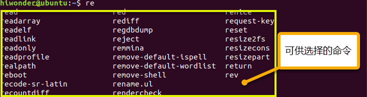

# Linux基础课程

## 6 Linux常见指令

通过前面的学习，我们已经掌握了一些基本的Linux指令。对于Linux新手来说，记忆数量巨大的Linux指令是学习的一大难点。不过无需担心，实际上我们只要掌握常见的十余种指令就可以上手Linux了。

下表为Linux常用的一些指令。

| 指令名         | 英文全称/翻译     | 意义        |
|-------------|-------------|-----------|
| Ls          | List/列出     | 列出当前目录下的文件 |
| cd          | Change Directory/更改目录 | 切换路径      |
| pwd         | Print Working Directory/显示工作目录 | 显示所在目录    |
| ping        | Packet Internet Groper/因特网包探索器 | 测试网络连接    |
| shutdown    | Shut down/关掉 | 用于关机      |
| reboot      | Reboot/重启   | 用于重启      |
| cp          | Copy/复制     | 用于复制      |
| rm          | Remove/去掉   | 删除        |
| mkdir       | Make directory/创建文件夹 | 创建文件夹     |
| man command | Manual/手册   | 显示command的帮助信息 |
| echo        | Echo/回显     | 将输入的内容回显到终端界面上 |
| sudo        | Superuser do/超级用户进行 | 以系统管理员身份执行指令 |
| clear       | Clear/清除    | 清除终端上的信息  |
| Find        | Find/查找     | 查找功能      |
| mv          | Move/移动     | 通过移动文件来实现重命名 |
| date        | Date/日期     | 读取系统的日期/时间 |

我们可以看到，这些指令基本是基于英文单词全称或简称组成的，如果你有一些英文基础，相信指令记起来会更加容易。另外需要说明一点，在Linux内是是严格区分大小写的，包括指令中大写和小写也是不同的。

### 6.1 Linux指令格式

指令+选项+操作对象这三部分构成了一个标准的Linux命令，其中命令部分需要输入命令的名称，选项部分定义命令的执行特性，这一特性可以有长短两个选项。

比如像长选项用“ --”引导，后面跟一个完整的单词，如--help；短选项用‘**-**’引导，后面跟单个的字符， 如 -a 。多个短选项可以组合使用，例如：-h -l -a == -hla，但是长选项不能组合使用，如--help后面就不能再跟另外一个单词了。例如下图所示：

大家需要注意，命令与选项，选项与选项，选项与操作对象，操作对象与操作对象它们之间是必须用空格分隔！至于操作对象就是图片中的/boot，操作对象是可以有多个的，操作对象与操作对象它们之间是必须用空格分隔！

### 6.2 Linux指令的实操

1.  启动虚拟机，使用快捷键“**Ctrl+Alt+T**”或者右键桌面选择黄框内的选项，进入终端界面。

2. 输入第一个指令“**pwd**”。我们知道“**pwd**”指令是用于显示所在目录，可以看到当前是处在/home目录下/hiwonder的文件夹内。

3. 紧接着输入指令“**ls**”。“**ls**”指令是让系统列出当前所在目录的文件信息，可使用“**ls -l**”和“**ls -a**”这样的参数获取文件权限、修改日期等信息。

4. 接下来因示例需要，顺便介绍一些实用技巧。点击键盘“**PrtSC**或**PRTSCR**”按键，将会自动对当前画面进行截屏，截屏的图片会存放在/home/Pictures下，截取完毕，单击左上角的“**文件管理器**”图标为即可找到。

 

5. 回到终端界面，使用“**cd**”指令跳转。前面我们已经列出所在目录的文件信息，接下来使用指令跳转到玩法所在“**/Pictures**”文件夹内。

Tips：在Linux系统中，可以使用“**Tab**”键来辅助指令输入。“**Tab**”键可以自动补全指令或文件（目录）名或文件（目录）路径。

例如，当我们想要“**/Pictures**”目录时，输入指令“**cd Pict**”，然后在键盘上按一下“Tab”键，指令会被自动补齐为“**cd Pictures/**”。每次按下“**Tab**”键后，若无相重合的字符，完整的文件名会立刻出现在指令行；若有名称字符重合，则会出现当前目录下所有以这几个字符开头的文件名称。

6. 现在已经进入截屏所在的目录，可再次使用指令“ls”查看该目录下有哪些文件。

7.  这些文件中以“**2019-08-28**”开头，“**.png**”结尾的文件就是我们刚才的截图文件。在以后的项目管理中，大家可以通过该方法来直接查找所需的项目或者文件。

### 6.3 高效的输入指令建议

#### 6.3.1 通过help

1)  在终端中以“**‘命令’ --help**”格式，可以帮助你查看某个命令的详细用法，我们以“**ls**”为例。

2)  在终端输入“**ls --help**”，黄框内是“**ls**”的更多用法。

3)  例如：在终端输入“**ls -a**”，即可看到文件夹内所有文件。

4)  例如：在终端输入“**ls -al**”，即可看到文件夹内，所有文件的属性。

#### 6..2 man手册介绍

接下来输入“**man**”指令。“**man**”指令是帮助手册manuel的缩写。当你忘记某一指令的时候或查看某指令的参数时，只要输入“**man**”指令，然后根据提示输入想要查找的东西，就得到详细的答案了。

1)  可以通过快捷键进行翻页操作，下表为页面操作快捷键。

|      功能      |            快捷键                  |
|:----------:|:----------------------------:|
| 往后翻一屏 |        SPACE（空格）         |
| 往前翻一屏 |              B               |
| 往后翻一行 |        ENTER（回车）         |
| 往前翻一行 |              K               |
|  返回终端  | :Q（先输入“:”号，再输入“Q”） |

2)  除了上述的指令和按键以外，在Linux系统内还有一些特殊控制按键。

|    按键    |       作用            |
|:------:|:------------------:|
|   ↑    |      指令历史      |
|  Tab   |      自动补全      |
| Ctrl+C |    中断运行程序    |
| Ctrl+D |    退出终端界面    |
| Ctrl+A | 光标移动到本行开头 |
| Ctrl+X | 光标移动到本行结尾 |

3)  比如要查询“**cp**”指令的意义，可以输入“**man cp**”指令，回车后可以看到下图所示内容。如图中红框处标注出来的内容就是“**cp**”指令的含义：复制文件和文件夹。

4)  接着往下翻，会有一个“**DESCRPTION**”，下面的内容是关于“**cp**”这个指令的详细说明。

#### 6.3.3 使用tab键补齐

1)  例如在终端输入“**re**”，并且按下“**Tab**”键。终端弹出带有“**re**”的命令供我们选择。

2)  在终端输入“**cd D**”，按下“**Tab**”键，将弹出该路径下所有名称含“**D**”的文件供我们选择。

3)  在终端根据提示输入文件时，按下“**Tab**”键，可以将文件名称自动补全。

