#  上手试玩

## 1 手机 APP 安装和连接

本节课会讲解如何安装手机 APP 以及连接设备。

### 1.1 安装方法

安卓系统：APP 安装包位于目录“**软件工具\5.手机 APP 安装包**”下，用户可将其导 入手机进行安装。

iOS 系统：可前往 App Store 搜索“WonderPi”并进行下载安装。

用户可以使用手机 APP“WonderPi”来控制 TurboPi。本节课会讲解如何将 TurboPi 与 APP 建立连接。

**注意：**

1) **安装时请对 APP 开放所有权限，以免影响 APP 的正常使用。**

2) **连接前，请将 TurboPi 开机。**

3) **打开 APP 前，需开启手机的 GPS 定位和 Wi-Fi 功能。**

4) **本节文档以安卓系统为例，操作方法同样适用于 iOS 系统。**

### 1.2设备连接

1) 打开树莓派扩展板上的电源开关，启动 TurboPi。如需了解具体操作步骤，可查 看目录“**学前先看\3 设备充电、开机及自检**”下的文档。

2) TurboPi 开机成功后，会进入 AP 直连模式，并生成一个以“**HW**”开头的热点，在 开始前先对连接模式进行了解。

#### 1.2.1 连接模式简介

1) AP 直连模式：开发板能够开启热点被手机连接上。(但不能联通外部网络)

2)  STA 局域网模式：开发板能够主动去连接指定的热点/Wi-Fi。(可联通外部网络)

#### 1.2.2 直连模式连接方法（必看）

1) 打开手机 APP“**WonderPi**”，依次点击“**初级套件**”、“**TurboPi**”。

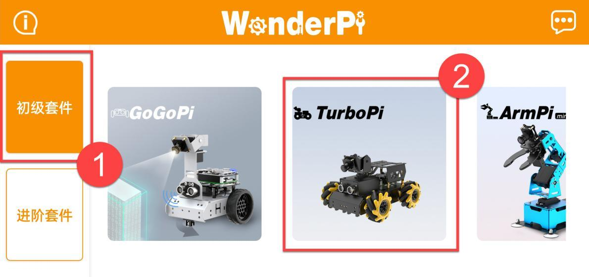

2) 点击界面右下角的“**+**”按钮，选择“**直连模式**”。

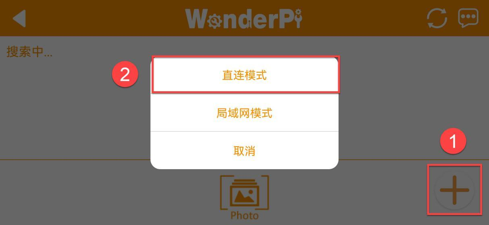

3) 点击“**去连接设备热点**”按键，前往设置界面，连接 TurboPi 生成的热点，连接 时需输入密码“**hiwonder**”。

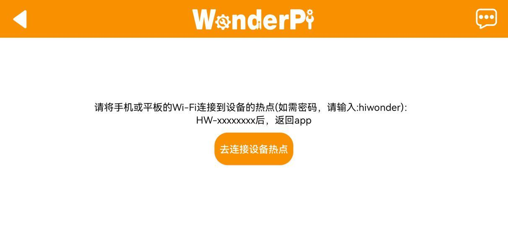

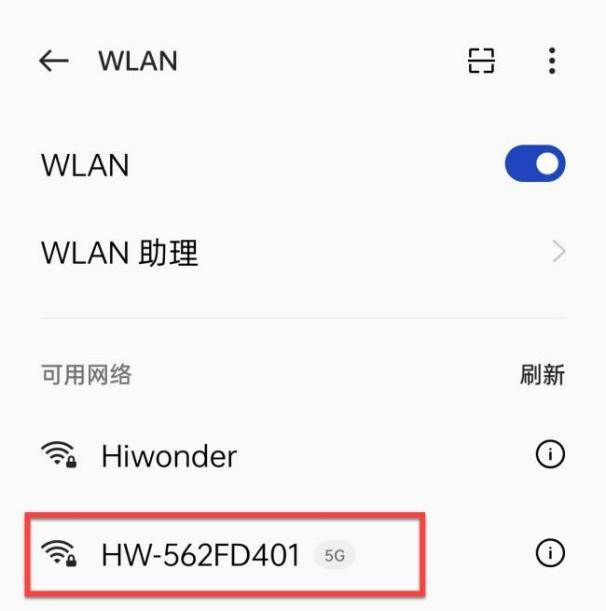

4) 连接成功后返回手机 APP。

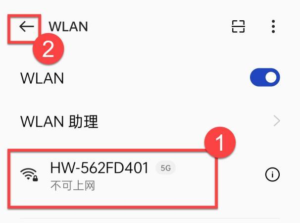

**注意：iOS 系统下，需等待手机状态栏显示 Wi-Fi 图标后再返回 APP，否则可能会搜索不到设备。若出现搜索不到设备的情况，可点击 APP 界面右上方的刷新图标 。**

 5) 此时 APP 将自动连接设备，稍等片刻，当搜索到下图所示图标时，即为连接成功。 

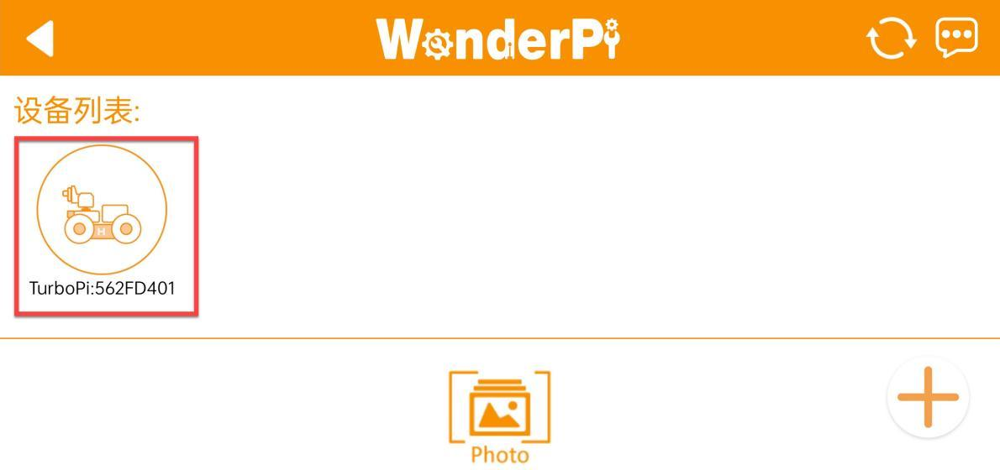

**注意：若出现“网络不可用，是否继续连接”的提示弹窗，单击“保持连接”按键即** **可。** 

6) 点击上图的 TurboPi 图标即可进入玩法模式选择界面，如下所示：

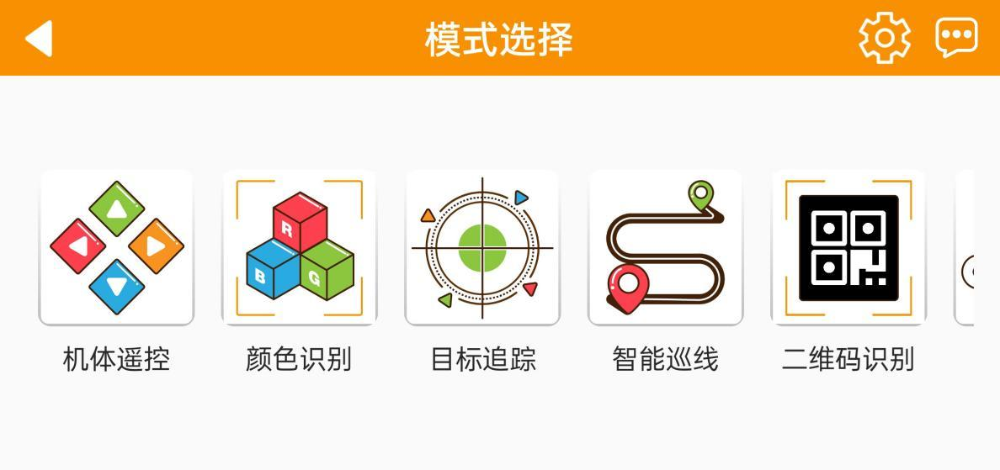

如需了解各个玩法的具体使用方法，可查看“**2 手机 APP 试玩**”文档。

#### 1.2.3 局域网模式连接方法（选看）

1) 断开之前 TurboPi 直连模式下的热点，将手机连接至一个 Wi-Fi，这里以连接名 称为：“**Hiwonder**”的 Wi-Fi 为例。

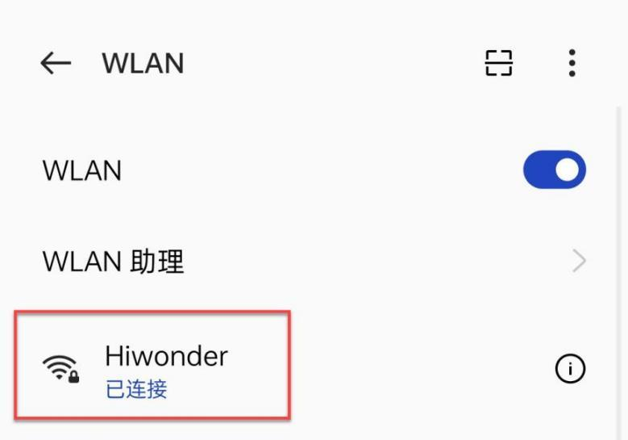

2) 连接完成之后，打开“**WonderPi**”，依次点击“**初级套件**”、“**TurboPi**”。

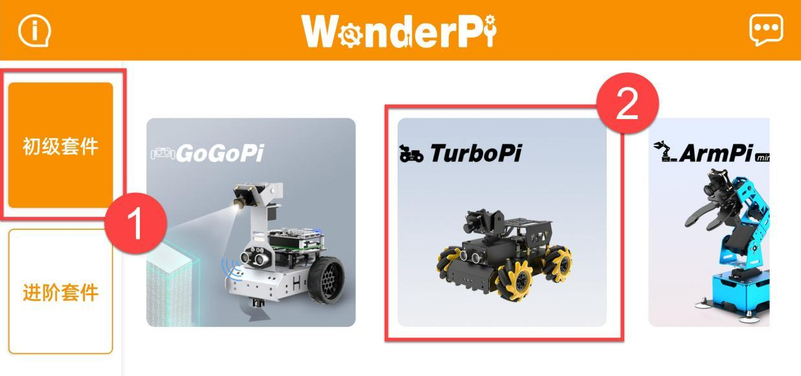

3) 然后单击右下角“**+**”按钮，选择“**局域网模式**”。

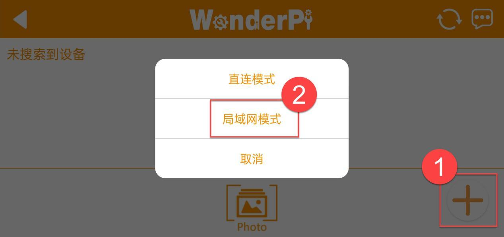

4) 此时 APP 会提示输入你所连接 Wi-Fi 的密码（请确认密码是否输入正确，如果输 入错误会导致连接失败），输入完成后点击“**好的**”。

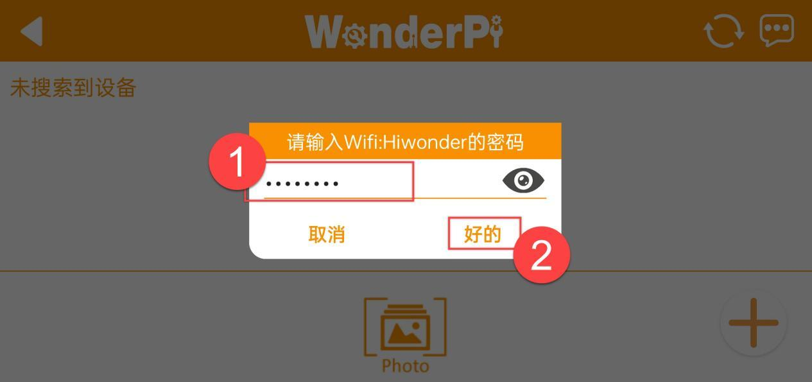

5) 再点击“**去连接设备热点**”。
    
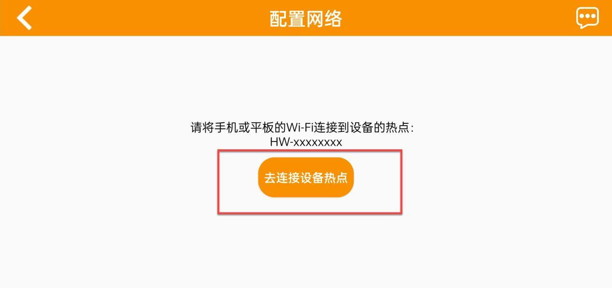

6) 此时手机会自动跳转到 Wi-Fi 连接页面，找到“**HW**”开头的热点，输入密码 “**hiwonder**”连接它。连接完成之后点击“**返回**”按钮。

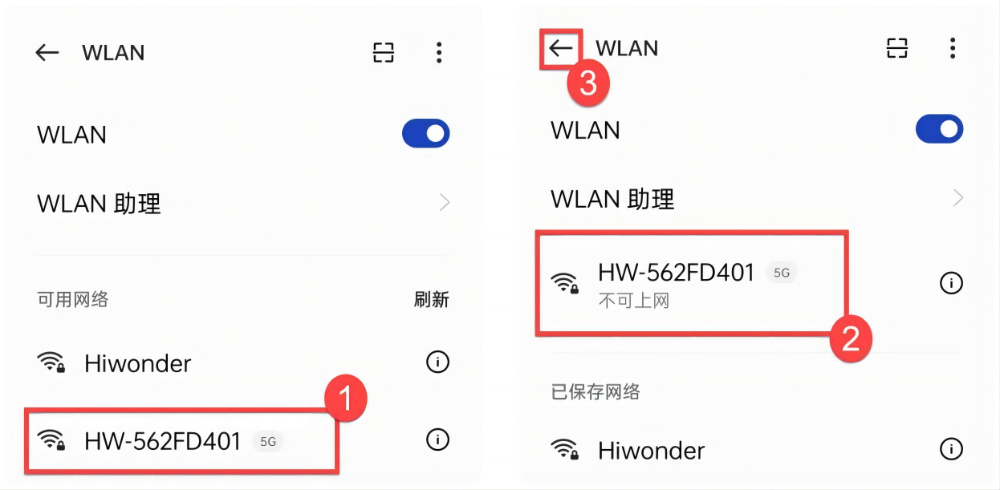

7) 连接完成后，可以看到 APP 已经开始自动配置网络了。

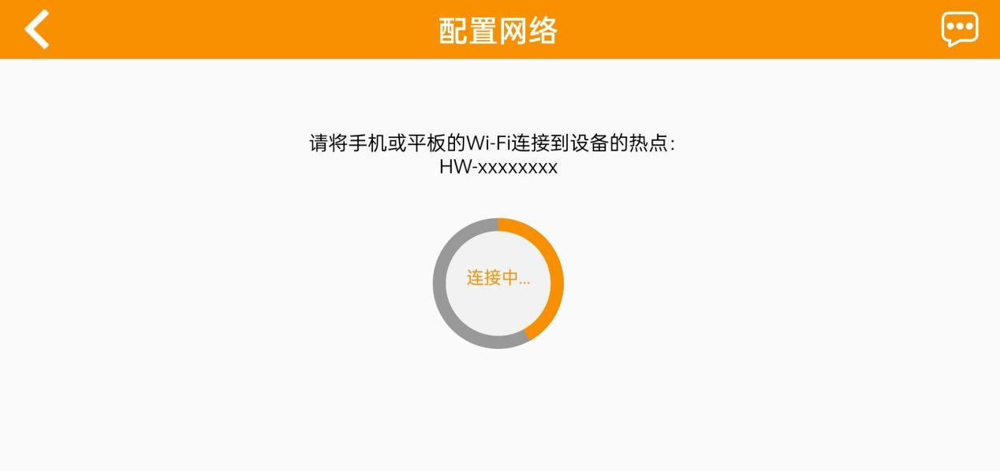

8) 稍等片刻，主界面会显示 TurboPi 的图标，同时扩展板上的 LED 灯也会常亮。

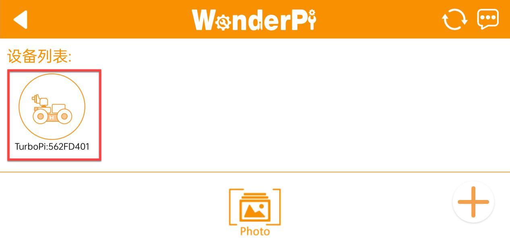

9) 长按 APP 中的 TurboPi 图标，可以查看分配给 TurboPi 的 IP 地址和 ID。

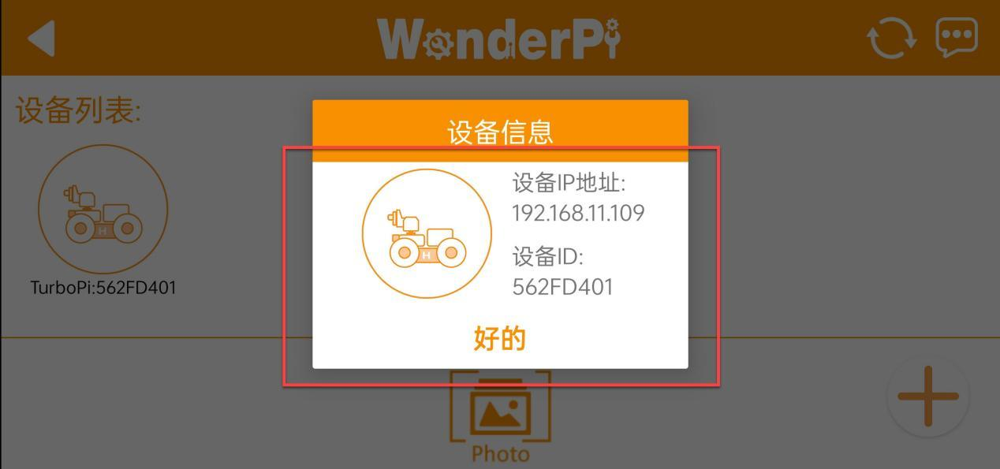

10) 点击 TurboPi 的图标，就可以进入到玩法页面了。

如需了解各个玩法的具体使用方法，可查看“**2 手机 APP 试玩**”文档。