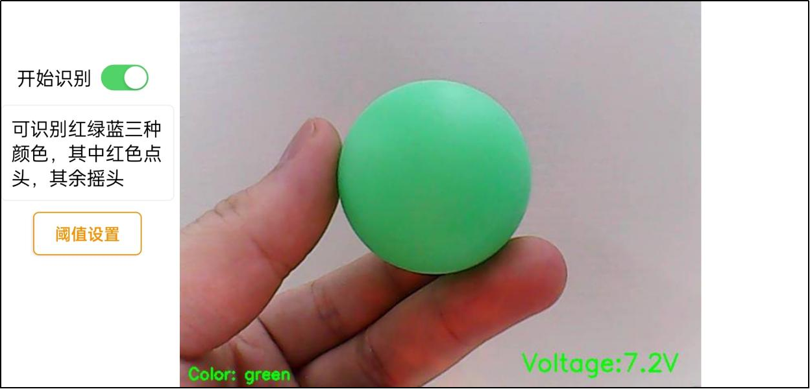

#  上手试玩

## 1 手机 APP 安装和连接

本节课会讲解如何安装手机 APP 以及连接设备。

### 1.1 安装方法

安卓系统：APP 安装包位于目录“**软件工具\5.手机 APP 安装包**”下，用户可将其导 入手机进行安装。

iOS 系统：可前往 App Store 搜索“WonderPi”并进行下载安装。

用户可以使用手机 APP“WonderPi”来控制 TurboPi。本节课会讲解如何将 TurboPi 与 APP 建立连接。

**注意：**

1) **安装时请对 APP 开放所有权限，以免影响 APP 的正常使用。**

2) **连接前，请将 TurboPi 开机。**

3) **打开 APP 前，需开启手机的 GPS 定位和 Wi-Fi 功能。**

4) **本节文档以安卓系统为例，操作方法同样适用于 iOS 系统。**

### 1.2 设备连接

1) 打开树莓派扩展板上的电源开关，启动 TurboPi。如需了解具体操作步骤，可查 看目录“**学前先看\3 设备充电、开机及自检**”下的文档。

2) TurboPi 开机成功后，会进入 AP 直连模式，并生成一个以“**HW**”开头的热点，在 开始前先对连接模式进行了解。

#### 1.2.1 连接模式简介

1) AP 直连模式：开发板能够开启热点被手机连接上。(但不能联通外部网络)

2)  STA 局域网模式：开发板能够主动去连接指定的热点/Wi-Fi。(可联通外部网络)

#### 1.2.2 直连模式连接方法（必看）

1) 打开手机 APP“**WonderPi**”，依次点击“**初级套件**”、“**TurboPi**”。

2) 点击界面右下角的“**+**”按钮，选择“**直连模式**”。

3) 点击“**去连接设备热点**”按键，前往设置界面，连接 TurboPi 生成的热点，连接 时需输入密码“**hiwonder**”。

4) 连接成功后返回手机 APP。

**注意：iOS 系统下，需等待手机状态栏显示 Wi-Fi 图标后再返回 APP，否则可能会搜索不到设备。若出现搜索不到设备的情况，可点击 APP 界面右上方的刷新图标 。**

 5) 此时 APP 将自动连接设备，稍等片刻，当搜索到下图所示图标时，即为连接成功。 

**注意：若出现“网络不可用，是否继续连接”的提示弹窗，单击“保持连接”按键即** **可。** 

6) 点击上图的 TurboPi 图标即可进入玩法模式选择界面，如下所示：

如需了解各个玩法的具体使用方法，可查看“**2 手机 APP 试玩**”文档。

#### 1.2.3 局域网模式连接方法（选看）

1) 断开之前 TurboPi 直连模式下的热点，将手机连接至一个 Wi-Fi，这里以连接名 称为：“**Hiwonder**”的 Wi-Fi 为例。

2) 连接完成之后，打开“**WonderPi**”，依次点击“**初级套件**”、“**TurboPi**”。

3) 然后单击右下角“**+**”按钮，选择“**局域网模式**”。

4) 此时 APP 会提示输入你所连接 Wi-Fi 的密码（请确认密码是否输入正确，如果输 入错误会导致连接失败），输入完成后点击“**好的**”。

5) 再点击“**去连接设备热点**”。
    

6) 此时手机会自动跳转到 Wi-Fi 连接页面，找到“**HW**”开头的热点，输入密码 “**hiwonder**”连接它。连接完成之后点击“**返回**”按钮。

7) 连接完成后，可以看到 APP 已经开始自动配置网络了。

8) 稍等片刻，主界面会显示 TurboPi 的图标，同时扩展板上的 LED 灯也会常亮。

9) 长按 APP 中的 TurboPi 图标，可以查看分配给 TurboPi 的 IP 地址和 ID。

10) 点击 TurboPi 的图标，就可以进入到玩法页面了。

如需了解各个玩法的具体使用方法，可查看“**2 手机 APP 试玩**”文档。

## 2 手机APP试玩

### 2.1 准备工作

1. 将TurboPi开机，先参照“**第1章 学前先看\\第5课 云台位置调节**”课程对云台舵机的偏差进行调节。

2. 再参照“**第2章 上手试玩**”下“第1课 手机APP安装与连接”教程，安装手机APP，并连接TurboPi机器人。

### 2.2 开始试玩

1. 连接完成后，点击TurboPi图标，进入模式选择界面。

2. 在模式选择界面中点击玩法对应的图标即可进入玩法界面。

#### 2.2.1 机体遥控

1. 该玩法可以实时控制小车运动及超声波的RGB灯；界面分为四个部分，各部分的描述以及功能图标如下所示：

- 状态栏：可以控制玩法的退出、回传画面的截图以及状态栏的隐藏；
- 控制栏：可以控制小车运动；
- 回传画面：显示摄像头的回传画面，并显示设备的电压值；
- 超声波RGB灯的调节：可以控制超声波模块的RGB灯开启、关闭以及亮起不同颜色的灯。

<table>
    <tr>
        <th>界面分布</th>
        <th>图标</th>
        <th>对应功能</th>
    </tr>
    <tr>
        <td rowspan="3">状态栏</td>
        <td></td>
        <td>返回按键，返回上一级的玩法选择菜单</td>
    </tr>
    <tr>
        <td>  </td>
        <td>对回传画面进行截图，并且保存到连接界面  的图库中</td>
    </tr>
    <tr>
        <td>  </td>
        <td>隐藏菜单栏</td>
    </tr>
    <tr>
        <td rowspan="3">控制栏</td>
        <td></td>
        <td>拖动中间的按钮，可控制TurboPi车体朝各个方向运动。</td>
    </tr>
    <tr>
        <td>  </td>
        <td>点击或长按此图标，可控制TurboPi车体原地逆时针转动。</td>
    </tr>
    <tr>
        <td>  </td>
        <td>点击或长按此图标，可控制TurboPi车体原地顺时针转动。 </td>
    </tr>
    <tr>
        <td>回传画面</td>
        <td></td>
        <td>在画面的右下角会显示TurboPi的电池电压。（注意：电池电压低于7V时需进行充电。）</td>
    </tr>
    <tr>
        <td>超声波RGB灯的调节</td>
        <td></td>
        <td>点击“RGB灯”按钮，可关闭、开启超声波的RGB灯；滑动彩色的滑杆，可调节超声波RGB灯的颜色。</td>
    </tr>
</table>

如需返回到玩法选择界面，点击空白区域调出状态栏，再点击左侧的图标即可。

#### 2.2.2 颜色识别

该玩法可以识别红、绿、蓝三种颜色，识别到红色点头，识别到蓝色或绿色摇头。

---
注意：

- 请在光线充足的室内环境下进行，但尽量避免在强光直射下进行。 
- 识别时，摄像头画面内请勿应无同目标颜色相同或相近的杂物，避免干扰识别。
- 如识别效果不佳，可前往目录“**上手试玩 \ 3 颜色阈值调试**”查看文档，学习颜色阈值的调节方式。

---

1. 点击“**颜色识别**”，进入玩法界面。该界面分为三个部分：

- 界面上方的是状态栏。

- 界面左侧是玩法的开启、关闭与颜色阈值调试区域；

- 界面右侧是摄像头回传画面区域。

2. 点击“**开始识别**”按钮，可依次将红色、蓝色、绿色的物体单独放置于摄像头前。以绿色为例，当识别到绿色时，TurboPi会在回传画面中将识别到的绿色框出来，然后蜂鸣器会先发出“**滴**”的一声提示，再执行“**摇头**”动作；

识别到绿色并将它框出来

对应蜂鸣器会发出“滴”提示，并将识别到的颜色显示在左下角

| **识别颜色** | **识别结果** |
| --- | --- |
| 红   | 蜂鸣器“滴”一声，摄像头点头。 |
| 绿   | 蜂鸣器“滴”一声，摄像头摇头。 |
| 蓝   | 蜂鸣器“滴”一声，摄像头摇头 |

3.  如需返回到玩法选择界面，点击当前界面的空白区域，调出标题栏，随后点击按键  即可。

#### 2.2.3 目标追踪

点击“**目标追踪**”，进入玩法界面。该玩法开启后可以实现小车随着目标颜色的移动而移动的功能。

---
注意：

- 请在光线充足的室内环境下进行，但尽量避免在强光直射下进行。
- 识别时，摄像头画面内请勿应无同目标颜色相同或相近的杂物，避免干扰识别。
- 如识别效果不佳，可前往目录“**第4章 手机APP试玩\\第4课 颜色阈值设置**”查看文档，学习颜色阈值的调节方式。

---

- 界面上方的是状态栏；
- 界面左侧是追踪开关区域；
- 界面右侧是摄像头回传画面区域。

1. 点击“**云台追踪**”按钮，再选择目标颜色即可启动追踪玩法，此时TurboPi的摄像头将跟随选定的颜色目标运动，车体不动

2. 若要实现车身跟随的玩法，需要同时选中“**云台追踪**”和“**车身跟随**”这两个按钮，此时TurboPi的车体和云台会跟随选定的颜色目标运动。

| **按钮图标**                                    | **功能说明** |
|---------------------------------------------| --- |
|  | 开启/关闭云台追踪玩法。 |
|  | 开启/关闭车身跟随玩法。 |
|  | 选择追踪的目标颜色。 |
|  | 显示目标颜色信息。 |

3. 如需返回到玩法选择界面，点击当前界面的空白区域，调出标题栏，随后点击按键即可。

#### 2.2.4 智能巡线

点击“**智能巡线**”，进入玩法界面。启动该玩法后，可以让小车沿着黑线或红线前进。

---
注意：

- 请在光线充足的室内环境下进行，但尽量避免在强光直射下进行。
- 识别时，摄像头画面内请勿应无同目标颜色相同或相近的杂物，避免干扰识别。
- 如识别效果不佳，可前往目录“**上手试玩 \ 3 颜色阈值调试**”查看文档，学习颜色阈值的调节方式。

---

- 界面上方的是状态栏；
- 界面左侧是巡线开关区域；
- 界面右侧是摄像头回传画面区域。

1. 点击“**开始巡线**”按钮，并选择巡线颜色，TurboPi将沿着目标颜色的线条前进。

| **按钮图标**                                    | **功能说明** |
|---------------------------------------------| --- |
|  | 开启/关闭玩法。 |
|  | 选择巡线目标颜色。 |
|  | 显示选中追踪的颜色。 |

1. 如需返回到玩法选择界面，点击当前界面的空白区域，调出标题栏，随后点击按键即可。

#### 2.2.5 二维码识别

点击“**二维码**”识别，进入玩法界面。该玩法启动后可以让小车的摄像头识别不同的二维码，执行对应的动作。

---
注意：

- 识别二维码时距离不宜太近或太远，一般二维码图片与摄像头相距为35cm为最佳。
- 请在光线充足的室内环境下进行，但尽量避免在强光直射下进行。

---

- 界面左侧是二维码开关及选择区域；
- 界面右侧是二维码画面。

1. 点击“**开始识别**”按钮，并选择不同的二维码，TurboPi将在识别到不同的二维码之后执行不同的动作。

| **按钮图标**                                    | **功能说明** |
|---------------------------------------------| --- |
|  | 小车执行前进动作的二维码 |
|  | 小车执行后退动作的二维码 |
|  | 小车执行左移动作的二维码 |
|  | 小车执行右移动作的二维码 |
|  | 显示选中的二维码信息 |

1. 如需返回到玩法选择界面，点击当前界面的空白区域，调出标题栏，随后点击按键即可。

#### 2.2.6 智能避障

点击“**智能避障**”，进入玩法界面。该玩法启动后可让小车通过超声波识别前方是否有障碍物并避开。

---
注意：请勿长时间近距离的检测物体

---

- 界面左侧避障玩法开关及障碍物阈值设置区域；
- 界面中间是摄像头回传画面区域；
- 界面右侧是RGB彩灯和电机速度设置区域。

1. 点击“**开始避障**”按钮，TurboPi将一直前进，检测到障碍物会左转直到没有障碍物，然后继续前进。

| **按钮图标**                                    | **功能说明** |
|---------------------------------------------| --- |
|  | 开启/关闭玩法。 |
|  | 调节障碍物阈值，单位为cm。 |
|  | 超声波RGB彩灯开启/关闭。 |
|  | 超声波RGB灯光颜色调节。 |
|  | 电机速度调节，数值越大，电机速度越快。 |

2. 如需返回到玩法选择界面，点击当前界面的空白区域，调出标题栏，随后点击按键即可。

## 3 颜色阈值调试

在不同光源下，物体颜色的呈现效果是不同的，而这一现象会对涉及颜色识别的功能玩 法产生一定程度的影响。针对这一问题，本节课会学习如何使用手机 APP“WonderPi”来 调节颜色阈值。

### 3.1 准备工作

将 TurboPi 开机，安装手机 APP“**WonderPi**”，并用其连接 TurboPi。如需了解具体 操作步骤，可查看目录“**上手试玩 \  2 手机 APP 安装与连接**”下的教程。

### 3.2界面介绍

进入玩法模式选择界面后，点击下图所示按键，即可进入颜色阈值调节界面。

 

 

下表是颜色阈值调节界面的功能说明：

| **图标**                                                                                      | **功能说明**                                                                              |
|---------------------------------------------------------------------------------------------|---------------------------------------------------------------------------------------|
|                                                   | 摄像头回传画面的处理后图像。  图像中，颜色物体区域表示为白色，其余部分表现为 黑色。                                     |
|                                                   | 摄像头回传画面的原始图像。                                                                         |
|                                                   | 选择当前调节的颜色。                                                                            |
|     | 调节回传画面的 L 分量（白~黑）范围，“ L_min”是范围下限，“ L_max”是范围上限。点击按键  可减小对应数值，点击按键 可增大数值。 |
|   | 调节回传画面的 A 分量（绿~红）范围，“a_min”是范围下限，“a_max”是范围上限。点击按键   可减小对应数值，点击按键 可增大数值。 |
|   | 调节回传画面的 B 分量（黄~蓝）范围，“b_min”是范围下限，“b_max”是范围上限。点击按键  可减小对应数值，点击按键  可增大数值。 |
|                                                  | 打开操作说明窗口，可查看颜色阈值调节方法。                                                                 |
|                                                  | 保存调节的阈值。                                                                              |
|                                                  | 返回玩法模式选择界面。                                                                           |
|                                                  | 隐藏导航栏。                                                                                |
|                                                  | 显示幻尔科技的信息窗口。                                                                          |

### 2.3 调节颜色阈值

1. 进入颜色阈值调节界面，选择需要调节阈值的颜色，此处以红色为例。

2. 将红色物体放置在摄像头的视野范围内，将 L、A、B 分量的最小值都调为“**0**”， 最大值都调为“**255**”。
 

3. 点击“**操作说明**”按键，查看颜色阈值的调节方法。

---
**注意：如需关闭操作说明窗口，点击“好的”即可。**

---

4. 由 LAB 颜色空间分布图可知，红色靠近“**+a**” ，即需要优先调整 A 分量。

5. “**a_max**”的数值保持不变，增大“**a_min**”的数值，直至处理后图像中的红色物 体区域显示为白色，其余部分显示为黑色。

6） 根据所处环境来调整 L 分量和 B 分量。若红色物体在环境下颜色偏浅，增大亮度 的最小值(**L_min**)；在环境下颜色偏深，则减小亮度的最大值(**L_max**)。若红色物体在环境 下偏暖色调，增大色度的最小值(**b_min**)；在环境下偏冷色调，减小色度的最大值(**b_max**)。

7） 完成阈值调节后，点击“**保存**”按键，保存调节好的阈值范围。

